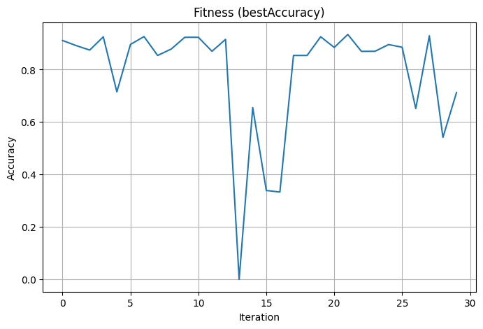

# Optimized SVM Classifier on UCI Dry Bean Dataset

This project demonstrates how to optimize Support Vector Machine (SVM) classifiers using multiple random splits of the UCI Dry Bean Dataset. It performs parameter tuning over 10 different train-test samples and identifies the best model configuration based on test accuracy.

---

## 📊 Dataset
- Source: [UCI Machine Learning Repository - Dry Bean Dataset](https://archive.ics.uci.edu/ml/datasets/Dry+Bean+Dataset)
- Multi-class dataset with 7 classes and ~13 features
- Size: ~13,000 rows

---

## 🔧 What the Code Does
- Reads and preprocesses the dataset (label encoding and scaling)
- Divides the data into 10 random 70-30 train-test samples
- For each sample, it runs 30 iterations of SVM training with randomized parameters:
  - `kernel`: linear, rbf, poly, sigmoid
  - `nu`: [0.01, 0.3] in steps
- Tracks accuracy per iteration and logs best parameters
- Saves accuracy results to `Optimized_SVM_Results.xlsx`
- Plots convergence graph for the best-performing sample

---

## 📈 Convergence Graph

---

## 🧪 Output Files
- `Optimized_SVM_Results.xlsx` — accuracy and parameters for each sample
- `convergence_plot.png` — accuracy graph for the best SVM model

---

## 📄 License
This project is licensed under the MIT License. See the [LICENSE](LICENSE) file for details.

---
